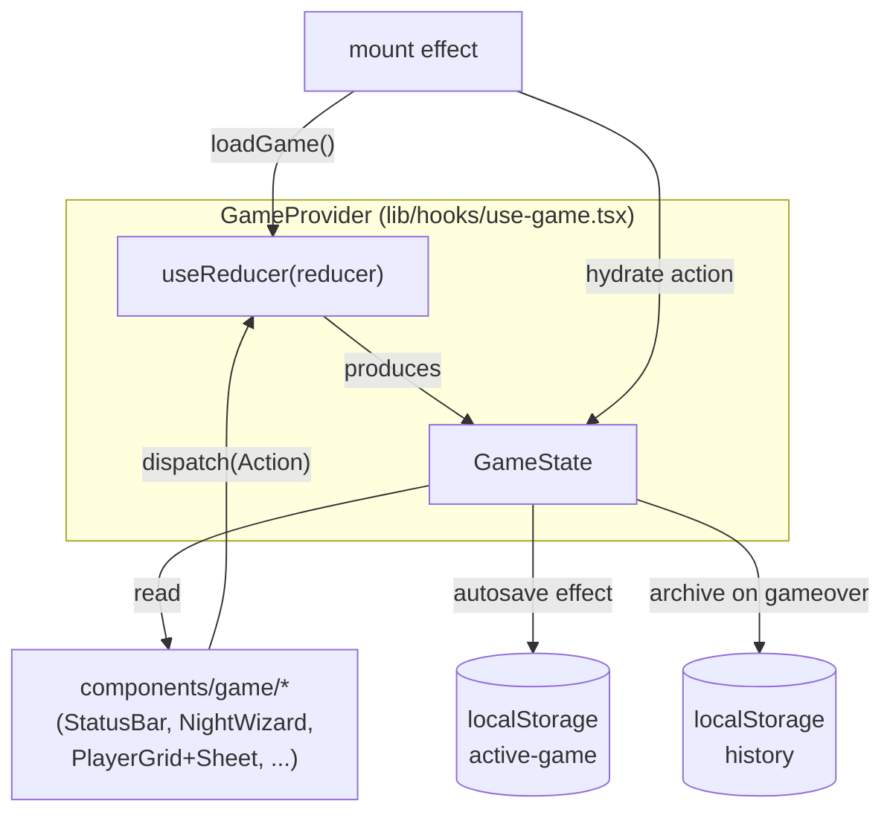

# Architecture

This document describes the **as-built** architecture of the Werewolf Moderator.
For product scope, rationale, and build-phase intent, see
[`01_master_plan/01_master_plan.md`](01_master_plan/01_master_plan.md). For
contributor conventions, see [`../AGENTS.md`](../AGENTS.md).

---

## 1. Overview

A local-only moderator tool for **Werewolf: Ultimate Deluxe Edition**. One
device, board-game use: a single player acts as moderator and the app guides
them through setup, night actions, day resolutions, and win detection.

It is a **pure client-side SPA** — no backend, no auth, no database. All state
lives in the browser via `useReducer` and persists to `localStorage`. The app
is shipped as a Next.js App Router project, but almost everything is a client
component; the framework is used as a bundler/host, not for its server
features.

**Mental model in one line:** a deterministic reducer owns the whole game
state, snapshots every action for undo/redo/rollback, autosaves on each change,
and the UI is a thin projection of that state.

---

## 2. Stack & Key Decisions

| Area | Choice | Why |
|---|---|---|
| Framework | Next.js 16 (App Router) | As specified; used effectively as a SPA host. |
| UI runtime | React 19 | Hooks, `useReducer`, concurrent features. |
| Styling | Tailwind v4 (`@import "tailwindcss"`, no config file) | `@theme` tokens in CSS; dark mode forced. |
| Components | shadcn/ui on the **Base UI** registry (`@base-ui/react/*`), lucide-react | Not Radix. Added via `npx shadcn@latest add`. |
| Language | TypeScript (strict) | All logic is type-safe. |
| State | `useReducer` + snapshot history | Deterministic transitions, free undo/redo, no state lib. |
| Persistence | `localStorage` | Survives refresh + finished-game archive. No DB. |
| Deploy | Vercel | Static client export. |

**Deliberate non-decisions:** no backend/database, no state library, no test
runner, no automated vote tallying, no pass-the-phone role reveal. Statistics
and Replay UIs are deferred (the data model captures enough to add them later).

> Next.js 16 differs from earlier versions in several APIs. The relevant guide
> lives in `node_modules/next/dist/docs/`. For this project, almost all
> server-side features are irrelevant (see §10 invariants).

---

## 3. Data Flow



```
                 ┌─────────────────────────────────────────┐
                 │            GameProvider                  │
                 │   useReducer(reducer) → GameState        │
                 └──────┬───────────────────────┬──────────┘
          read state   │                       │  dispatch(action)
                        ▼                       ▼
   ┌──────────────── components/game/* ─────────────────┐
   │  StatusBar · NightWizard · PlayerGrid/Sheet ·      │
   │  TimelineDrawer · Lobby · WinnerScreen · ...       │
   └────────────────────────────────────────────────────┘
                        │  every state change
           ┌────────────┴────────────┐
           ▼                         ▼
   saveGame → localStorage     archiveGame → localStorage
   (active-game key)           (history key, once on gameover)
```

### Hydration: after mount, not in the initializer

`GameProvider` seeds the reducer with `createInitialState()` (empty), then in a
`useEffect` **after mount** loads `localStorage` and dispatches `hydrate`. This
is deliberate: reading storage in the reducer initializer would cause an
SSR/client hydration mismatch (the server renders empty, the first client
render would render the saved game). By hydrating after mount, the server and
first client render agree on the empty state. See the invariant in §10.

---

## 4. Directory Layout

```
werewolf-moderator/
├── app/                         # Next.js App Router routes
│   ├── layout.tsx               # SOLE server component: <html>/<body>,
│   │                            #   next/font, metadata/viewport, globals.css,
│   │                            #   wraps children in <GameProvider>
│   ├── globals.css              # Tailwind v4 @import + @theme tokens + dark palette
│   ├── page.tsx                 # 'use client' landing: New Game / Continue
│   ├── play/page.tsx            # 'use client' — phase router (the moderator board)
│   ├── error.tsx                # 'use client' error boundary
│   ├── not-found.tsx            # 404
│   ├── icon.svg / apple-icon.tsx / manifest.ts   # PWA metadata
│
├── components/
│   ├── game/                    # domain UI (all 'use client')
│   │   ├── lobby.tsx            #   setup: players + roles + validation + start
│   │   ├── role-picker.tsx      #   role count selector grouped by team
│   │   ├── night-wizard.tsx     #   guided, reorderable night-action queue
│   │   ├── status-bar.tsx       #   always-on: phase, counts, effects, win hints, undo/redo
│   │   ├── player-grid.tsx      #   seat grid; opens the sheet on tap
│   │   ├── player-card.tsx      #   one seat: name, role, effects, eliminate button
│   │   ├── player-sheet.tsx     #   bottom sheet: the override surface (kill/revive/role/effects)
│   │   ├── timeline-drawer.tsx  #   undo history → rollback to any snapshot
│   │   └── winner-screen.tsx    #   gameover: winner, roster, event log, new game
│   └── ui/                      # shadcn primitives (Base UI backed, not Radix)
│
├── lib/
│   ├── game/                    # the engine (pure, framework-agnostic)
│   │   ├── types.ts             #   ALL domain types (see §5)
│   │   ├── roles.ts             #   role registry: 46 roles, teams, descriptions, night actions
│   │   ├── reducer.ts           #   single mutation entrypoint + commit/snapshot/undo/redo
│   │   ├── engine.ts            #   deal, night-queue build, dawn resolve, phase advance
│   │   ├── effects.ts           #   idempotent effect add/remove helpers
│   │   ├── win-conditions.ts    #   checkWinner: parity, cult, tanner side-win
│   │   ├── setup.ts             #   initial state, player/role CRUD, validateSetup
│   │   ├── storage.ts           #   localStorage load/save/clear (active game)
│   │   ├── history.ts           #   FinishedGame archive (dedup-guarded)
│   │   ├── role-art.ts          #   which role slugs have /public/characters art
│   │   └── team-style.ts        #   team → label/dot/ring presentation maps
│   ├── hooks/
│   │   └── use-game.tsx         #   GameProvider + useGame(): the single state entrypoint
│   └── utils.ts                 #   cn() class-merge helper
│
├── docs/
│   ├── architecture.md          # ← this file
│   ├── 01_master_plan/          # product scope, decisions, build-phase notes
│   ├── ultimate_werewolf_manual.txt   # committed rulebook (BASE set, not Deluxe)
│   └── werewolf_role.md         # secondary role reference
│
├── public/characters/           # role art PNGs (slug-named)
└── components.json              # shadcn base-nova registry config
```

---

## 5. The Game Engine (`lib/game/`)

The engine is pure and framework-agnostic — it knows nothing of React. It is a
set of functions that take `GameState` and return `GameState`. The reducer is
the only thing React calls.

### 5.1 Types (`types.ts`)

The single source of truth for the domain model:

- **`Phase`** — `"setup" | "night" | "day" | "gameover"`.
- **`Team`** — `"village" | "werewolf" | "vampire" | "cult" | "neutral"`.
- **`RoleId`** — a union of **46** role id literals. The Amulet of Protection
  is **not** a role; it is modeled as `EffectType "amulet"`.
- **`Role`** — `{ id, name, team, description, nightAction? }`.
- **`NightAction`** — `{ defaultOrder, prompt, firstNightOnly? }`. The
  `defaultOrder` is **authored**, not extracted from the manual (the manual
  gives only a suggested order, e.g. "Werewolves before Witch"). It is a sane
  default; the queue is freely reorderable at runtime.
- **`Effect` / `EffectType`** — status on a player: `protected`, `diseased`,
  `cursed`, `amulet`, `lover-link`, `cult`, plus witch once-per-game flags
  (`witch-heal-used`, `witch-kill-used`).
- **`Player`** — `{ id, name, roleId, alive, effects, diedAt? }`.
- **`GameState`** — `{ players, rolePool, phase, nightNumber, log, past, future,
  winner?, nightQueue? }`. The `nightQueue` lives **in** state so a mid-night
  refresh survives autosave and undo reaches inside a night.
- **`NightQueue`** — `{ steps: NightStep[], cursor }`. Each `NightStep` carries
  a `playerId` (real id, or a synthetic group id `"__wolves"` / `"__vampires"`),
  the `roleId` whose prompt it shows, and an optional `NightOutcome`.
- **`NightOutcome`** — a discriminated union: `none | kill | protect | convert |
  link | view | note`. Mechanical kinds carry `targetIds`; `view` is info-only
  (Seer/Sorcerer point, nothing changes at dawn); `note` is free text.

### 5.2 The reducer (`reducer.ts`)

The **single mutation entrypoint**. It is a switch over a discriminated `Action`
union with four groups:

1. **Setup** (`addPlayer`, `renamePlayer`, `removePlayer`, `movePlayer`,
   `addRole`, `removeRole`, `resetSetup`) — thin wrappers over `setup.ts`.
2. **Engine** (`startGame`, `setNightOutcome`, `reorderNightStep`,
   `advancePhase`, `recordDayDeath`) — delegate to `engine.ts`.
3. **Override** (`killPlayer`, `revivePlayer`, `setRole`, `addEffect`,
   `removeEffect`) — moderator overrides; see §8.
4. **History** (`undo`, `redo`, `rollback`, `hydrate`) — see below.

#### The snapshot pattern (`commit` / `slim`)

Every mutating action (except `hydrate`) routes through `commit(pre, post,
label)`:

```
commit → pushes { label, state: slim(pre), at } onto post.past, clears future
slim   → strips past/future arrays before snapshotting
```

The `slim` step is critical: without it, each snapshot nests the previous state
(including *its own* `past`), and `JSON.stringify` expands the DAG
exponentially — **2^N** by action count. `slim` keeps snapshots flat. History is
bounded to `MAX_HISTORY = 100` entries.

`undo` pops `past` into `future`; `redo` reverses it; `rollback(to)` jumps to an
arbitrary past snapshot and drops the redo branch.

### 5.3 The engine (`engine.ts`)

The core game-flow logic:

- **`dealRoles`** — Fisher–Yates shuffle of `rolePool`, dealt to seats in order.
  `Math.random` is fine here — this is a board-game shuffle, not a secret.
- **`buildNightQueue`** — assembles the ordered night steps:
  - Groups the wolf pack (`werewolf`, `wolf-cub`, `lone-wolf`) into one
    `__wolves` step; groups vampires into one `__vampires` step.
  - Adds one step per other alive role that has a `nightAction`.
  - Drops `firstNightOnly` roles after night 1; skips Apprentice Seer while the
    Seer lives; skips Drunk except on night 3.
  - Sorts by `nightAction.defaultOrder`.
- **`resolveDawn`** — the dawn resolver. Applies recorded outcomes in a fixed
  priority:
  1. Collect protections, kills, conversions, links from queue outcomes.
  2. **Diseased check** — if wolves carry the `diseased` effect, their kills are
     skipped this night and the sickness clears.
  3. Resolve kills → deaths, honoring protection, wolves-can't-kill-vampires,
     and Cursed-turns-to-wolf-instead-of-dying.
  4. Apply conversions (Cult: adds `cult` effect, keeps role).
  5. Apply Soulmate links (Cupid: `lover-link` effect with partner id as source).
  6. Apply deaths + the **heartbreak cascade** (a dead Soulmate takes their
     partner; loops until stable).
  7. Diseased trigger: if a Diseased player died to wolves, sicken the wolf team.
  8. Hunter reprisal is a moderator prompt, not auto-resolved.
  9. Win check; transition to `day` or `gameover`.
- **`recordDayDeath`** — manual lynching / day elimination; runs the same
  `applyDeaths` (with heartbreak cascade) + win check.
- **`advancePhase`** — night→dawn→day, or day→night (increment nightNumber,
  rebuild queue).

> **The night engine philosophy.** This is a **guided, reorderable queue + dawn
> resolver**, *not* a dependency solver. The rulebook lists only a *suggested*
> call order; effects resolve at dawn in a fixed priority. This matches physical
> play and is far less code than a dependency graph. The `ponytail:` deferral:
> upgrade to a dependency graph only if specific role interactions break.

### 5.4 Effects (`effects.ts`)

Small, idempotent helpers: `hasEffect`, `addEffect` (no-op if already present),
`removeEffect`, `effectAt`, `clearNightProtections`. Effects live on
`Player.effects[]`.

> `ponytail:` per-night-repeat rules (Bodyguard "not the same target two nights")
> rely on the moderator — `protected` is cleared each dawn and there is no
> multi-night protection history. Upgrade if it bites.

### 5.5 Win conditions (`win-conditions.ts`)

`checkWinner(state)` returns `{ winner?, sideWins }`:

- **Tanner** — wins on death; `sideWins` carries it; the game continues.
- **Cult** — wins if every surviving player is in the cult.
- **Werewolves** — win at parity when no rival predator (vampire) is alive.
- **Vampires** — symmetric: win at parity when no wolves are alive.
- **Village** — wins when all predators are dead.

> `ponytail:` **deferred** cases, pending the real Deluxe rulebook: Lone Wolf
> override, Hoodlum target marks, and the Cupid soulmate pair-win (Soulmates on
> different teams win as the last two, overriding other conditions). The
> heartbreak cascade is handled in `engine.ts` before `checkWinner` runs, so
> team composition already reflects it.

---

## 6. State, Persistence & History

### `GameProvider` / `useGame()` (`lib/hooks/use-game.tsx`)

The **single state entrypoint**. `GameProvider` wraps the app (in `layout.tsx`)
and exposes `{ state, dispatch }` via context.

- **Seed** — `createInitialState()` (empty setup).
- **Hydrate** — `useEffect` on mount: `loadGame()` → `dispatch({ type:
  "hydrate", state: saved })`. Marks `archivedRef` if the restored game is
  already `gameover` (it was archived before the reload — don't re-archive).
- **Autosave** — `useEffect` on every state change: `saveGame(state)`.
- **Archive** — when `phase` becomes `gameover` and `archivedRef` is false:
  `archiveGame(state)` and set the ref. Reset to false on any non-gameover
  state (a new game can start from a gameover via `resetSetup`).

### Storage (`storage.ts`)

- `loadGame` / `saveGame` / `clearGame` against `localStorage` key
  `"werewolf-mod:active-game"`. Best-effort: private mode / quota means no
  autosave, never a crash.

### History (`history.ts`)

- `buildFinishedGame(state)` — derives a compact archive record: id, endedAt,
  nights, winner, sideWins, roster (name/role/alive), and the full event log.
- `archiveGame` — prepends to `"werewolf-mod:history"` (max 50), guarded by a
  dedup signature (winner + nights + roster) as belt-and-suspenders against a
  refresh-mid-gameover re-archive. The `archivedRef` in the provider is the
  primary guard.

---

## 7. Domain Model: Roles

There are **46** `RoleId`s in `types.ts`. The role registry in `roles.ts`
defines each role's `id`, `name`, `team`, `description`, and optional
`nightAction`.

**Important caveat:** the committed rulebook
(`docs/ultimate_werewolf_manual.txt`) is the **base** Ultimate Werewolf manual,
**not** the Ultimate Deluxe Edition. It documents ~26 of the 46 roles. The
remaining ~20 are **stubbed** — team only, placeholder description — and tagged
`ponytail:` in `roles.ts`. Their teams are assigned from stable canon so
setup/validation work, but their powers are unverified. Treat any change to a
stubbed role the same way: tag it `ponytail:`.

Naming notes from the Deluxe edition: the manual's "Sorceress" → `sorcerer`;
"Vampires" → `vampire`. The Amulet of Protection is an **item** (`EffectType
"amulet"`), not a role.

Helpers: `getRole(id)`, `ROLE_LIST`, `rolesByTeam(team)`.

---

## 8. Presentation Layer

### Phase router (`app/play/page.tsx`)

The play screen switches on `state.phase`:

| Phase | Renders | Purpose |
|---|---|---|
| `setup` | `<Lobby>` | players + roles + validation + start |
| `night` | `<NightBoard>` | StatusBar + NightWizard + PlayerGrid; "Resolve dawn" advances |
| `day` | `<DayBoard>` | StatusBar + PlayerGrid (eliminate on tap); "Begin next night" advances |
| `gameover` | `<WinnerScreen>` | winner banner, roster, event log, new game |

Day 1 is discussion-only (no vote); night 1 deals roles and runs first-night
actions.

### Key components

- **`StatusBar`** — always-on situational awareness: phase/night, alive/dead
  count, pending night actions, surfaced effects (cult/diseased/soulmates),
  live win-condition hints (parity warnings), and undo/redo/history buttons.
  Also hosts the `TimelineDrawer`.
- **`NightWizard`** — the moderator's guided night queue. Shows one step at a
  time with an outcome picker keyed by role kind (`kill`/`protect`/`convert`/
  `link`/`view`/`note`/`witch`). Steps are freely reorderable; the wizard
  auto-advances to the next pending step after a record. An "All steps" list
  lets the moderator jump to any step.
- **`PlayerGrid` / `PlayerCard`** — seat grid. Cards show name, role, team dot,
  effect badges, and (in day mode) an eliminate button. Tapping a card opens
  the `PlayerSheet`.
- **`PlayerSheet`** — the **override surface**: kill/revive, change role, add/
  remove any effect. This is where "the moderator overrides everything" lives.
- **`TimelineDrawer`** — undo history as a labeled list; each entry rolls back
  to that snapshot (drops the redo branch).
- **`WinnerScreen`** — winner banner (team-colored), side-wins (Tanner), final
  roster, collapsible event log, New Game / Home.

### Presentation helpers (`team-style.ts`, `role-art.ts`)

- `team-style.ts` — `TEAM_ORDER`, `TEAM_LABEL`, `TEAM_DOT` (tailwind bg class),
  `TEAM_RING`. The single source for team colors/labels.
- `role-art.ts` — `HAS_ART` set of role slugs with `/public/characters/<id>.png`;
  others fall back to a team monogram.

### shadcn / Base UI

UI primitives in `components/ui/` are from the shadcn **`base-nova`** registry.
They import from `@base-ui/react/*`, **not** `@radix-ui/*`. Add new primitives
with `npx shadcn@latest add <name>`; do not hand-write Radix imports.

### Theme

Dark mode is **forced** — `className="dark"` is always on `<html>` in
`layout.tsx`. There is no theme toggle. `globals.css` defines the dark palette
via `@theme` tokens (oklch colors) plus phase-aware surface tints (`--night-tint`,
`--day-tint`) consumed by the status bar and night/day boards. Design for dark.

---

## 9. Moderator Overrides Everything

The foundational design principle: **the engine guides, but never blocks.** The
night queue is a suggestion; dawn resolution is a convenience; overrides are
always available. Concretely:

- Day voting is **manual** — the moderator runs votes out loud and records only
  the result (`recordDayDeath`). There is no tally engine.
- There is **no role-reveal screen** — the moderator announces roles or uses
  physical cards.
- The `PlayerSheet` exposes kill/revive, arbitrary role changes, and add/remove
  of any effect at any time.
- An imperfect night-step kind never breaks a game — the moderator can skip any
  step or override the result.

This is also the mitigation for role-accuracy risk: because the moderator can
override anything, the ~20 stubbed roles (§7) never produce an unfixable state.

---

## 10. Verification Approach

There is **no test runner** and no `test`/`lint` script. Verification is:

1. **`npm run typecheck`** — `tsc --noEmit`. All logic is type-safe; run before
   declaring work done.
2. **`npm run build`** — production build. Run before declaring work done.
3. **Dev-only `selfCheck()` functions** — each engine module (`reducer.ts`,
   `engine.ts`, `effects.ts`, `win-conditions.ts`, `setup.ts`, `history.ts`)
   ends with an `assert`-based `selfCheck()` gated on `process.env.NODE_ENV !==
   "production"`. These run on module load in dev, exercising the core flows
   (deal → queue → dawn → win; undo/redo; effect idempotence; validation). They
   are the substitute for a test suite — keep them green.
4. **`ponytail:` comments** — non-trivial or unverified logic carries a brief
   `ponytail:` tag noting the simplification, its ceiling, and the upgrade path.

---

## 11. Key Invariants & Gotchas

- **Hydrate after mount, not in the reducer initializer.** Reading `localStorage`
  in the initializer causes an SSR/client hydration mismatch. The provider
  hydrates in a `useEffect`. Do not "fix" this by moving it into the initializer.
- **Always `slim()` before snapshotting.** `commit()` strips `past`/`future`
  from the pre-state. Forgetting this makes snapshots nest exponentially.
- **History is bounded.** `MAX_HISTORY = 100` snapshots; `MAX_LOG = 200` log
  entries; history archive capped at 50 games. These prevent unbounded
  `localStorage` growth.
- **`nightQueue` lives in state.** It is present only during `phase ===
  "night"`. Storing it in state (not component state) means a mid-night refresh
  survives autosave and undo can reach inside a night.
- **Archive is once-per-gameover.** Guarded by `archivedRef` in the provider
  (primary) and a dedup signature in `history.ts` (belt-and-suspenders).
- **`useSearchParams()` in a static client component needs `<Suspense>`** or the
  production build fails (Next.js 16).
- **`params` / `searchParams` are Promises in v16** — `await` them. (This app
  largely avoids dynamic routes, so minimal impact.)
- **shadcn here is Base UI, not Radix.** Don't hand-write `@radix-ui/*` imports
  or assume the Radix-based shadcn API.
- **Forced dark mode.** The `dark` class is always on `<html>`; design for dark,
  do not add a theme toggle.
- **`metadata` / `viewport` exports only in Server Components** — keep them in
  `layout.tsx`.
